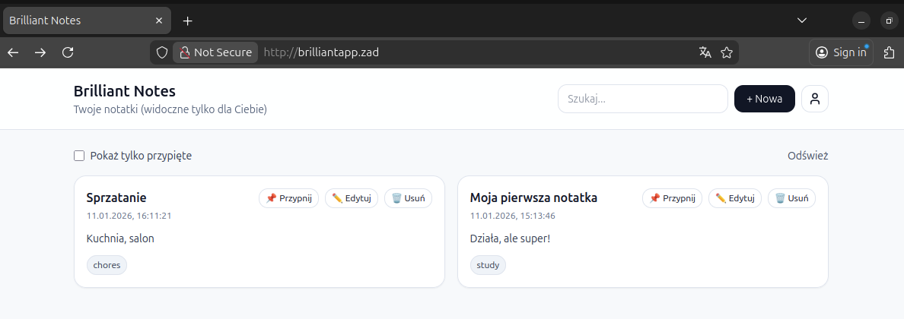
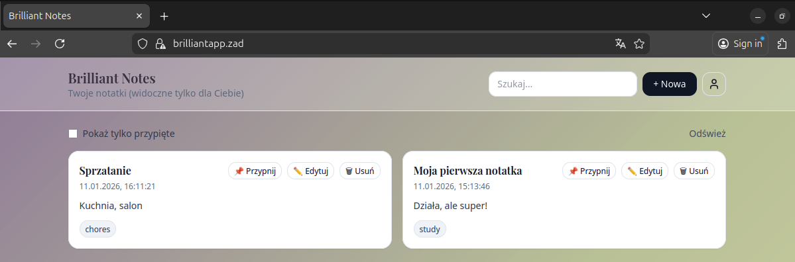

# Zadanie nr 2

# Część obowiązkowa

## Opis aplikacji

Na potrzeby zadania stworzyłam prostą aplikację BrilliantNotesApp. To aplikacja webowa służąca do zarządzania osobistymi notatkami. Z funkcjonalnego punktu widzenia jest to system typu CRUD (Create, Read, Update, Delete), umożliwiający użytkownikom rejestrację, logowanie oraz zarządzanie zasobami zalogowanego użytkownika. Aplikacja została zaprojektowana jako SPA, gdzie interfejs użytkownika komunikuje się z serwerem wyłącznie poprzez API.

### Implementacja

Aplikacja została zaimplementowana w stacku Django: JavaScript - Python - Django - MySQL.
Frontend zaimplementowany w czystym języku JavaScript wraz z HTML5 i CSS3. Jest to aplikacja statyczna serwowana przez serwer Nginx. Backendoparty jest na języku Python i frameworku Django. Do przechowywania danych wykorzystano relacyjną bazę danych MySQL.

### Wdrożenie w środowisku klastra

Każda warstwa stack-a (Frontend, Backend, Baza danych) działa jako niezależny Deployment i Pod, co pozwala na niezależne skalowanie i aktualizowanie poszczególnych części systemu.  
Dane wrażliwe, takie jak hasła do bazy danych, zostały odseparowane od kodu aplikacji i są wstrzykiwane do kontenerów za pomocą obiektów Kubernetes Secrets, natomiast konfiguracja nieszyfrowana (nazwa bazy, host) poprzez ConfigMaps. Komunikacja między backendem a bazą danych odbywa się wewnątrz klastra z wykorzystaniem wewnętrznego systemu DNS Kubernetesa (usługa mysql-service), co izoluje bazę danych od dostępu z zewnątrz.  
Zastosowano obiekt Ingress pełniący rolę Reverse Proxy. Jest on kluczowym elementem architektury, który udostępnia aplikację pod adresem http://brilliantapp.zad.

## Pliki konfiguracyjne wdrożenia

### backend/Dockerfile

```
# Wersja slim, aby zminimalizować rozmiar końcowego obrazu, zachowując jednocześnie pełną funkcjonalność Pythona.
FROM python:3.12-slim
WORKDIR /app

# Instalacja zależności systemowych dla mysqlclient
RUN apt-get update && apt-get install -y \
    pkg-config \
    default-libmysqlclient-dev \
    build-essential \
    && rm -rf /var/lib/apt/lists/*

COPY requirements.txt .
RUN pip install --no-cache-dir -r requirements.txt

COPY . .

EXPOSE 8000

# Uruchomienie migracji i serwera przy starcie
CMD ["sh", "-c", "python manage.py migrate && python manage.py runserver 0.0.0.0:8000"]
```

### frontend/Dockerfile

```
# Obraz bazowy Alpine Linux (mały rozmiar i wysoki poziom bezpieczeństwa)
FROM nginx:alpine

# Usuwam domyślną stronę nginx
RUN rm -rf /usr/share/nginx/html/*

# Kopiuję frontend
COPY . /usr/share/nginx/html

EXPOSE 80
```

### k8s/mysql.yaml

```
apiVersion: v1
kind: Secret
metadata:
  name: mysql-secret
type: Opaque
stringData:
  # user root, haslo puste
  mysql-root-password: ""
  mysql-user: "root"
  mysql-password: ""
```

Obiekt Secret przechowuje dane wrażliwe: hasła użytkownika i roota bazy danych. Użycie obiektu Secret zamiast wpisywania haseł jawnym tekstem w definicji Deploymentu jest praktyką bezpieczeństwa w Kubernetes.

```
apiVersion: v1
kind: ConfigMap
metadata:
  name: mysql-config
data:
  mysql-database: "brilliantnotes"
```

ConfigMap przechowuje dane konfiguracyjne, które nie są tajne. Pozwala to na zmianę konfiguracji bez konieczności przebudowywania obrazu.

```
apiVersion: apps/v1
kind: Deployment
metadata:
  name: mysql
spec:
  selector:
    matchLabels:
      app: mysql
  strategy:
    type: Recreate
  template:
    metadata:
      labels:
        app: mysql
    spec:
      containers:
        - name: mysql
          image: mysql:8.0
          env:
            - name: MYSQL_ALLOW_EMPTY_PASSWORD
              value: "yes"
            - name: MYSQL_DATABASE
              valueFrom:
                configMapKeyRef:
                  name: mysql-config
                  key: mysql-database
          ports:
            - containerPort: 3306
```

Deployment uruchamia jedną instancję bazy danych MySQL w wersji 8.0. Zmienne środowiskowe kontenera są mapowane bezpośrednio z utworzonych wcześniej ConfigMap i Secret.

```
apiVersion: v1
kind: Service
metadata:
  name: mysql-service
spec:
  ports:
    - port: 3306
  selector:
    app: mysql
```

Service typu ClusterIP nadaje stabilny adres IP i nazwę DNS wewnątrz klastra. Dzięki temu inne serwisy (backend) mogą odwoływać się do bazy po nazwie hosta mysql-service, niezależnie od tego, na jakim węźle fizycznie znajduje się Pod z bazą. Port 3306 nie jest wystawiony na zewnątrz klastra.

### k8s/backend.yaml

```
apiVersion: apps/v1
kind: Deployment
metadata:
  name: backend
spec:
  replicas: 1
  selector:
    matchLabels:
      app: backend
  template:
    metadata:
      labels:
        app: backend
    spec:
      containers:
        - name: backend
          image: brilliant-backend:v1 # Obraz zbudowany lokalnie w Minikube
          imagePullPolicy: Never # Użyj lokalnego obrazu
          ports:
            - containerPort: 8000
          env:
            - name: DB_HOST
              value: "mysql-service"
            - name: DB_NAME
              valueFrom:
                configMapKeyRef:
                  name: mysql-config
                  key: mysql-database
            - name: DB_USER
              valueFrom:
                secretKeyRef:
                  name: mysql-secret
                  key: mysql-user
            - name: DB_PASSWORD
              valueFrom:
                secretKeyRef:
                  name: mysql-secret
                  key: mysql-password
```

Deployment backend definiuje wdrożenie aplikacji Django. `imagePullPolicy: Never` wymusza użycie obrazu zbudowanego lokalnie, zamiast próby pobrania go z zewnętrznego rejestru (Docker Hub). Deployment wstrzykuje do kontenera zmienne DB_HOST, DB_NAME, DB_USER, DB_PASSWORD. Aplikacja w settings.py odczytuje te wartości, co uniezależnia kod aplikacji od specyfiki środowiska. DB_HOST ustawiony na mysql-service wykorzystuje wewnętrzny system DNS Kubernetesa do odnalezienia bazy.

```
apiVersion: v1
kind: Service
metadata:
  name: backend-service
spec:
  selector:
    app: backend
  ports:
    - port: 8000
      targetPort: 8000
```

Service typu ClusterIP wystawia aplikację na porcie 8000 wyłącznie dla ruchu wewnątrz klastra. Dostęp z zewnątrz będzie realizowany przez Ingress.

### k8s/frontend.yaml

```
apiVersion: apps/v1
kind: Deployment
metadata:
  name: frontend
spec:
  replicas: 1
  selector:
    matchLabels:
      app: frontend
  template:
    metadata:
      labels:
        app: frontend
    spec:
      containers:
        - name: frontend
          image: brilliant-frontend:v1 # Obraz zbudowany lokalnie
          imagePullPolicy: Never
          ports:
            - containerPort: 80
```

Deployment frontend wdraża serwer Nginx z plikami statycznymi. Analogicznie jak na backendzie, użyto polityki Never dla obrazu.

```
apiVersion: v1
kind: Service
metadata:
  name: frontend-service
spec:
  selector:
    app: frontend
  ports:
    - port: 80
      targetPort: 80
```

Service typu ClusterIP udostępnia frontend na porcie 80 wewnątrz sieci klastra.

### k8s/ingress.yaml

```
apiVersion: networking.k8s.io/v1
kind: Ingress
metadata:
  name: brilliant-ingress
spec:
  rules:
    - host: brilliantapp.zad
      http:
        paths:
          # Ruch do API (backend)
          - path: /api
            pathType: Prefix
            backend:
              service:
                name: backend-service
                port:
                  number: 8000
          # Ruch do administracji serwera (obecnie nieużywane w aplikacji, a le adres jest dostępny)
          - path: /admin
            pathType: Prefix
            backend:
              service:
                name: backend-service
                port:
                  number: 8000
          # Ruch do statycznego frontendu (reszta)
          - path: /
            pathType: Prefix
            backend:
              service:
                name: frontend-service
                port:
                  number: 80
```

Obiekt Ingress pełni rolę Reverse Proxy oraz API Gateway. Skonfigurowano w nim wirtualny host brilliantapp.zad.  
Ścieżki /api oraz /admin są kierowane do serwisu backend-service na port 8000.  
Ścieżka / (główna) jest kierowana do serwisu frontend-service na port 80.

## Ilustracja uruchomienia

System został wdrozony za pomocą następujących poleceń:

```
~/PFSwChO/zad2/BrilliantNotesApp$ docker build -t brilliant-backend:v1 ./backend
~/PFSwChO/zad2/BrilliantNotesApp$ docker build -t brilliant-frontend:v1 ./frontend
~/PFSwChO/zad2/k8s$ kubectl apply -f mysql.yaml
~/PFSwChO/zad2/k8s$ kubectl apply -f backend.yaml
~/PFSwChO/zad2/k8s$ kubectl apply -f frontend.yaml
~/PFSwChO/zad2/k8s$ kubectl apply -f ingress.yaml
```

Następnie została zweryfikowana poprawność utworzenia poszczególnych elementów:

```
emilia@wojcik:~/PFSwChO/zad2/k8s$ kubectl get all
NAME                            READY   STATUS    RESTARTS      AGE
pod/backend-57bbd7fd48-dhbh8    1/1     Running   0             2m35s
pod/frontend-847f87b565-rnw4f   1/1     Running   0             2m28s
pod/mysql-6bf46d6594-7nq28      1/1     Running   0             2m43s

NAME                       TYPE        CLUSTER-IP      EXTERNAL-IP   PORT(S)    AGE
service/backend-service    ClusterIP   10.110.32.253   <none>        8000/TCP   2m35s
service/frontend-service   ClusterIP   10.106.173.94   <none>        80/TCP     2m28s
service/kubernetes         ClusterIP   10.96.0.1       <none>        443/TCP    10m
service/mysql-service      ClusterIP   10.96.13.249    <none>        3306/TCP   2m43s

NAME                       READY   UP-TO-DATE   AVAILABLE   AGE
deployment.apps/backend    1/1     1            1           2m35s
deployment.apps/frontend   1/1     1            1           2m28s
deployment.apps/mysql      1/1     1            1           2m43s

NAME                                  DESIRED   CURRENT   READY   AGE
replicaset.apps/backend-57bbd7fd48    1         1         1       2m35s
replicaset.apps/frontend-847f87b565   1         1         1       2m28s
replicaset.apps/mysql-6bf46d6594      1         1         1       2m43s
```

Aby adres http://brilliantapp.zad działał na komputerze, należy dodać do pliku /etc/hosts wpis:

```
127.0.0.1 brilliantapp.zad
```
A także uruchomić proces przekierowania ruchu z portu 80 hosta na port 80 serwisu Ingress Controller. Dzięki temu zabiegowi aplikacja jest dostępna lokalnie pod stałym adresem.
```
sudo kubectl port-forward -n ingress-nginx service/ingress-nginx-controller 80:80
```

Dzięki temu aplikacja jest dostępna w przeglądarce pod wskazanym w poleceniu adresem.


# Część nieobowiązkowa

## Zmiany w aplikacji

W ramach aktualizacji zostało zmienione tło aplikacji, a także czcionka, którą wyswietlane są nagłówki. W związku z tym, zmianie uległ plik `frontend/index.html`, gdzie zostały umieszczone nowe style.

## Zmiany w plikach konfiguracyjnych

Aby aktualizacja przebiegła bez przerywania działania, Kubernetes musi wiedzieć, kiedy nowy kontener jest gotowy do przyjęcia ruchu. Do tego służą Readiness Probes.

Zmianom uległy następujące manifesty:

### k8s/frontend.yaml -> k8s_extra/frontend.yaml

Zmieniona definicja Deploymentu

```
apiVersion: apps/v1
kind: Deployment
metadata:
  name: frontend
spec:
  replicas: 2  # Zwiększam do 2, żeby lepiej widzieć rolling update
  strategy:
    type: RollingUpdate
    rollingUpdate:
      maxUnavailable: 0  # Podczas aktualizacji żaden pod nie może być niedostępny
      maxSurge: 1        # Może być 1 dodatkowy pod ponad limit podczas aktualizacji
  selector:
    matchLabels:
      app: frontend
  template:
    metadata:
      labels:
        app: frontend
    spec:
      containers:
      - name: frontend
        image: brilliant-frontend:v1 # To zmieniam komendą na v2 później
        imagePullPolicy: Never
        ports:
        - containerPort: 80
        # SONDY
        livenessProbe:
          httpGet:
            path: /
            port: 80
          initialDelaySeconds: 5
          periodSeconds: 10
        readinessProbe:
          httpGet:
            path: /
            port: 80
          initialDelaySeconds: 2
          periodSeconds: 5
```

Dodana została sekcja livenessProbe i readinessProbe oraz strategia aktualizacji.

### k8s/backend.yaml -> k8s_extra/backend.yaml

Zmieniona definicja Deploymentu

```
apiVersion: apps/v1
kind: Deployment
metadata:
  name: backend
spec:
  replicas: 1
  strategy:
    type: RollingUpdate
  selector:
    matchLabels:
      app: backend
  template:
    metadata:
      labels:
        app: backend
    spec:
      containers:
      - name: backend
        image: brilliant-backend:v1
        imagePullPolicy: Never
        ports:
        - containerPort: 8000
        env:
        - name: DB_HOST
          value: "mysql-service"
        - name: DB_NAME
          valueFrom:
            configMapKeyRef:
              name: mysql-config
              key: mysql-database
        - name: DB_USER
          valueFrom:
            secretKeyRef:
              name: mysql-secret
              key: mysql-user
        - name: DB_PASSWORD
          valueFrom:
            secretKeyRef:
              name: mysql-secret
              key: mysql-password
        # SONDY
        livenessProbe:
          tcpSocket:
            port: 8000
          initialDelaySeconds: 10
          periodSeconds: 15
        readinessProbe:
          tcpSocket:
            port: 8000            # Sprawdzenie dostępności portu aplikacji
          initialDelaySeconds: 10 # Czas na start Django i połączenie z DB
          periodSeconds: 5        # Częste sprawdzanie podczas aktualizacji
          failureThreshold: 3     # Odporność na pojedyncze błędy
```

Tu także zostały dodane sondy. Backend potrzebuje więcej czasu na start i połączenie z bazą.

Strategia RollingUpdate dla Deploymentów skonfigurowana została z parametrami:

- maxUnavailable: 0: podczas aktualizacji liczba dostępnych podów nigdy nie spadnie poniżej zadeklarowanej wartości. Kubernetes nie usunie starego poda, dopóki nowy nie będzie w pełni gotowy.
- maxSurge: 1: pozwala na tymczasowe utworzenie jednego dodatkowego poda ponad limit w celu przeprowadzenia migracji.

Zastosowano ponadto dwa rodzaje sond dla serwisów Frontend i Backend:

- Liveness Probe: monitoruje, czy kontener żyje. Typ: httpGet (dla Frontendu jest to optymalne dla serwera Nginx, ponieważ odpowiedź HTTP 200 potwierdza, że serwer WWW działa i serwuje pliki) oraz tcpSocket (dla Backendu, ponieważ najszybciej potwierdza on otwarcie gniazda nasłuchującego, co jest sygnałem gotowości do procesowania żądań API.).
- Readiness Probe: istotny element dla Rolling Update, ma za zadanie sprawdzać, czy aplikacja jest gotowa do obsługi ruchu sieciowego. Dopiero gdy readinessProbe zwróci sukces (status 200 OK lub udane połączenie TCP), Kubernetes uzna nowy pod za "Ready" i zacznie kierować do niego ruch z Ingressa/Serwisu. Zapobiega to wyświetlaniu błędów użytkownikom w momencie startu aplikacji (np. gdy Django jeszcze nawiązuje połączenie z bazą danych).

## Ilustracja aktualizacji

Zastosowanie nowych manifestów:

```
~/PFSwChO/zad2/k8s_extra$ kubectl apply -f backend.yaml
~/PFSwChO/zad2/k8s_extra$ kubectl apply -f frontend.yaml
```

Zbudowanie nowej wersji obrazu frontendu:

```
~/PFSwChO/zad2/BrilliantNotesApp$ docker build -t brilliant-frontend:v2 ./frontend
```

Uruchomienie Rolling Update - aktualizacja obrazu w działającym Deploymencie:

```
kubectl set image deployment/frontend frontend=brilliant-frontend:v2
```

Obserwacja aktualizacji:

```
emilia@wojcik:~/PFSwChO/zad2/BrilliantNotesApp$ kubectl rollout status deployment/frontend
Waiting for deployment "frontend" rollout to finish: 1 old replicas are pending termination...
Waiting for deployment "frontend" rollout to finish: 1 old replicas are pending termination...
deployment "frontend" successfully rolled out
```

Dzięki przeprowadzonej aktualizacji, wygląd aplikacji uległ zmianie.

